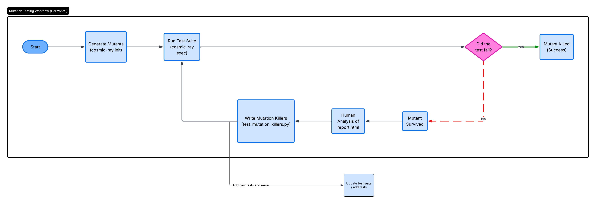
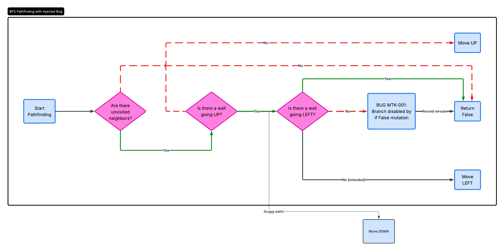
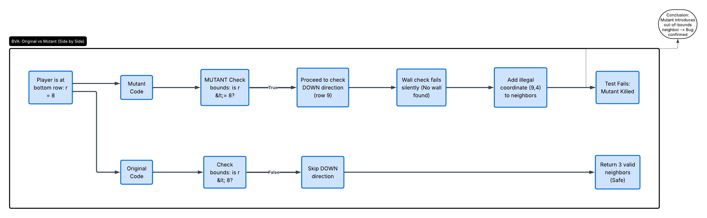

# Raport Final: Testarea Sistemului QuoridorEnv

## Introducere și Mediul de Lucru

### Obiectivul proiectului
Acest fișier documentează procesul de testare aplicat pe structura de bază a jocului Quoridor, mai precis pe clasa `QuoridorEnv`. Obiectivul a fost verificarea corectitudinii jocului pe baza intrărilor și ieșirilor, făcând abstracție de implementările din spate ale codului, dar și validarea logicii interne a metodelor critice (acoperirea instrucțiunilor, deciziilor și identificarea circuitelor independente), conform standardelor de testare software. De asemenea, lucrarea include o analiză de testare mutațională și o evaluare comparativă a testelor folosind agenți AI.

### Configurația Hardware și Software
Pentru execuția și validarea tuturor scenariilor de testare, a fost utilizată următoarea configurație:
*   **Hardware:** Execuție locală pe mașina fizică a echipei (fără utilizarea unei mașini virtuale - VM).
*   **Sistem de Operare:** Windows 10.
*   **Mediu Software:** Python 3.10+, framework-ul `pytest` pentru rularea testelor.
*   **Integrări externe:** SDK-ul `google-genai` conectat la Google AI Studio (utilizând modelul `gemini-2.5-flash` pentru generarea rapidă și deterministă a testelor).

### Tehnologiile alese (Tooling)

#### De ce am ales `pytest` în loc de `unittest`?
*   **Simplitate și Claritate:** `unittest` este un framework mai vechi care te obligă să scrii foarte mult "cod de umplutură" (clase și structuri rigide) doar pentru a face o verificare banală. În contrast, `pytest` merge pe ideea de simplitate: scrii testele ca pe niște funcții normale și naturale, făcând proiectul mult mai rapid de citit și de întreținut.
*   **Pregătirea automată a testelor:** Pentru un joc cum este Quoridor, avem nevoie de o tablă curată de joc la fiecare test. `pytest` simplifică enorm acest flux printr-un sistem prin care pregătește "scena" automat în fundal, fără să fim nevoiți să duplicăm codul de resetare.
*   **Standardul industriei:** Astăzi, Pytest este standardul *de facto* în companiile de IT moderne. Mai mult, oferă o experiență mult mai prietenoasă când un test eșuează: îți arată exact unde și de ce valorile nu s-au potrivit, oferind feedback imediat, spre deosebire de rapoartele adesea mai greu de descifrat din vechiul `unittest`.

**Un mic exemplu practic (unittest vs pytest)**

*Varianta `unittest` (mai mult "boilerplate code"):*
```python
import unittest

def factorial(n):
    if n < 0:
        raise ValueError("Factorial is not defined for negative numbers")
    elif n == 0:
        return 1
    else:
        return n * factorial(n-1)

class TestFactorial(unittest.TestCase):
    def test_positive(self):
        self.assertEqual(factorial(5), 120)

    def test_zero(self):
        self.assertEqual(factorial(0), 1)

    def test_negative(self):
        with self.assertRaises(ValueError):
            factorial(-1)

if __name__ == '__main__':
    unittest.main()
```

*Varianta `pytest` (simplă și directă):*
```python
import pytest

def factorial(n):
    # Funcția originală rămâne la fel
    pass

def test_positive():
    assert factorial(5) == 120

def test_zero():
    assert factorial(0) == 1

def test_negative():
    with pytest.raises(ValueError):
        factorial(-1)
```

---

## Capitolul 1: Testare Funcțională (Black-Box)

Acest capitol documentează procesul de testare funcțională (de tip black-box) aplicat pe structura de bază a jocului Quoridor. 
Clasa `QuoridorEnv` conține logica pentru plasarea pionilor pe o tablă de 9x9 și plasarea pereților pe o tablă internă de 8x8 (indexată de la 0 la 7). Orice acțiune, cum ar fi încercarea de a așeza un perete, trece printr-o serie de validări complexe. Sistemul verifică dacă peretele iese în afara tablei, dacă se suprapune cu un alt perete existent, dacă intersectează o piesă similară în formă de cruce sau, foarte important, dacă mutarea respectivă blochează complet drumul pionului advers către linia de final.

Pentru a demonstra tehnicile de testare funcțională pe acest model, am selectat validarea și restricțiile plasării pereților orizontali, aplicând două tehnici standard de testare software: **Partiționarea în Clase de Echivalență (EP)** și **Analiza Valorilor de Frontieră (BVA)**.

### 1.1 Validarea suprapunerilor (Overlaps H)

Funcția `_overlaps_h(self, wr, wc)` verifică strict dacă poziția pe care se dorește plasarea unui perete orizontal este deja ocupată sau obstrucționată de ceva existent pe aceeași axă. Au fost identificate 4 clase de echivalență distincte, ce acoperă integral starea tablei de joc:

| Clasa | Condiție de testare | Output așteptat | Explicație aplicativă |
| :--- | :--- | :--- | :--- |
| **S_1** | Există deja perete pe aceeași locație | `True` | Se încearcă plasarea de perete fix la locația (3,3) peste altul pus la (3,3). |
| **S_2** | Perete care obstrucționează din stânga | `True` | Un perete existent la (3,2) extins blochează spațiul cerut inițial. |
| **S_3** | Perete care obstrucționează din dreapta | `True` | Un perete existent la (3,4) extins blochează locația curentă. |
| **S_4** | Tabla este complet liberă | `False` | Lipsa vreunui obstacol învecinat pe direcția respectivă, permițând plasarea. |

### 1.2 Verificarea finală a mutărilor (BVA și EP)

Funcția `_legal_h_wall(self, wr, wc)` răspunde de decizia finală privind legalitatea oricărei acțiuni de plasare orizontală. Având în vedere că aduce cu sine validări pentru toate mecanicile jocului în același timp, s-a impus organizarea testelor direct pe limitele matricei prin Analiza Valorilor de Frontieră (BVA), pe lângă condițiile de mediu.

Parametrii principali testați au fost rândurile (`wr`), coloanele (`wc`) și stocul de pereți în sine (`walls_left`). Frontierele logice detectate conform documentației sunt:
* Cazul rândurilor și coloanelor din tablă permit setări în intervalul de încadrare natural între 0 și 7. Marginea pe frontiere sigure se testează la extremitățile de colț la valorile **0 și 7**.
* În consecință, depășirile minime și primele elemente pur invalide se află la o mutare distanță, respectiv valorile limitrofe eronate **-1** și **8**.
* Stocul unui jucător curge în joc de la limita inferioară până la 10 (cifra pereților disponibili limitați per jucător). În condiții de limitare impusă se ajunge la limita interzisă de validare pe barieră însemnând **0 pereți rămași**.

Sub aceste premize, construcția acoperă complet limitele pe frontieră plus bariere de regulament:

| Metoda de test în script | Frontiera validată / Clasa EP | Parametrii de setat tehnic | Output așteptat |
| :--- | :--- | :--- | :--- |
| `test_bva_1_top_left_edge` | BVA valid: Colțul stânga-sus și epuizare de limită a resurselor. | `wr=0`, `wc=0`, `walls=1` | `True` |
| `test_bva_2_top_right_edge`| BVA valid: Colțul dreapta-sus complet. | `wr=0`, `wc=7`, `walls=10`| `True` |
| `test_bva_3_bottom_left_edge` | BVA valid: Colțul stânga-jos valid sub frontiera inferioară. | `wr=7`, `wc=0`, `walls=1` | `True` |
| `test_bva_4_bottom_right_edge`| BVA valid: Colțul dreapta-jos. | `wr=7`, `wc=7`, `walls=10`| `True` |
| `test_bva_c2_invalid_row_negative` | BVA invalid: Coordonata pe minus. Intrare greșită către array. | `wr=-1`, `wc=3` | `False` |
| `test_bva_c3_invalid_row_too_large`| BVA invalid: Depășirea cadrului superior cu o unitate.| `wr=8`, `wc=3` | `False` |
| `test_bva_c4_invalid_col_negative` | BVA invalid: Împingerea coordonatei în minus negativ.| `wr=3`, `wc=-1` | `False` |
| `test_bva_c5_invalid_col_too_large`| BVA invalid: Creșterea dimensiunii cerute către dreapta și interzis.| `wr=3`, `wc=8` | `False` |
| `test_bva_c6_no_walls_left` | BVA invalid: Test când stocul curent s-a ridicat epuizat și arată frontiera bariera zero. | `walls=0` pe rând | `False` |
| `test_ep_c7_horizontal_overlap` | EP state: Un caz normal unde peretele cerut întâmpinat cu perete inserat din stânga. | Suprapunere dublă pe (3,3) | `False` |
| `test_ep_c8_vertical_crossing` | EP state: Caz din pathfinding direct când e interzis între doi pereți pe altă axă intersectați total. | Intersecție orizontal vs vertical | `False` |
| `test_ep_c9_blocks_path_to_goal`| EP state: Analiză de pathfinding logic în care bariera va cauza izolarea unui actor. | Construcția unei capcane perfecte cu pereți verticali | `False` |

Comanda normală de execuție standard dacă rulăm local pachetul ar fi:
```bash
python -m pytest tests/test_functional_quoridor.py -v
```

---

## Capitolul 2: Testare Structurală (White-Box)

Această secțiune detaliază abordarea aleasă pentru etapa de Testare Structurală. Obiectivul principal a fost validarea logicii interne a metodelor critice, asigurând acoperirea instrucțiunilor, a deciziilor (Branch Coverage) și identificarea circuitelor independente.
Având în vedere complexitatea ridicată a validărilor din joc, am optat pentru dezvoltarea unui **cadru de testare automatizat propriu**, care îmbină analiza statică a codului cu Inteligența Artificială Generativă.

### 2.1 Analiza Fluxului de Control și Circuitele Independente

Pentru a satisface cerința identificării circuitelor independente, este necesară trasarea Grafurilor Fluxului de Control (CFG) și calcularea Complexității Ciclomatice. Am dezvoltat un modul de analiză automată (`graph_generator.py`).

**Metodologia utilizată:**
* Am folosit biblioteca nativă `ast` (Abstract Syntax Tree) din Python pentru a parsa codul sursă.
* Scriptul identifică toate nodurile de decizie (`if`, `elif`, bucle) și generează automat reprezentarea vizuală a grafului sub formă de cod *Mermaid*.
* Totodată, algoritmul calculează automat elementele de control și **Complexitatea Ciclomatică** pentru fiecare metodă analizată.

**Rezultate obținute:** Au fost analizate 20 de metode principale ale proiectului. Toate grafurile rezultate, împreună cu detaliile aferente, au fost exportate cu succes în directorul `tests/control_flow_graphs/`.

### 2.2 Acoperirea Deciziilor (Branch Coverage) prin Agenți AI

Pentru scrierea testelor unitare care să parcurgă fiecare ramură decizională extrasă anterior, am creat un script de generare (`generate_tests.py`), orchestrat de un agent inteligent (`test_generator/ai_agent.py`) conectat la API-ul Google Gemini.

**Fluxul de execuție al agentului (The Agentic Loop):**
1. **Contextualizare:** Sistemul trimite către LLM codul sursă al unei metode și o condiție specifică extrasă din CFG (de exemplu: determină testul să intre pe ramura `if r2 == r1 + 1:`).
2. **Generare:** LLM-ul redactează o funcție de test folosind framework-ul `pytest`, incluzând datele de intrare (mock-uri) necesare pentru a forța evaluarea condiției respective ca fiind adevărată.
3. **Validare și Auto-Corectare:** Inovația acestui flux constă în validarea locală. Agentul rulează imediat testul generat în fundal. Dacă testul eșuează, agentul preia direct raportul de eroare (Traceback) și îl trimite înapoi modelului Gemini cu instrucțiunea de a corecta codul. Procesul se repetă de până la 5 ori (cu *exponential backoff*) până la obținerea unui test valid (PASSED).

Pentru a verifica acoperirea ramurilor și succesul testelor generate, se folosește următoarea comandă:
```bash
python -m pytest tests/test_structural_quoridor.py -v
```
Acest ansamblu de teste se concentrează excepțional pe validările de plasare a pereților temporari și permanenți (ex: metodele `_blocked_with_temp`), demonstrând că ramurile care preiau excepții funcționează conform specificațiilor.

---

## Capitolul 3: Testare Mutațională

Pentru evaluarea calității testelor noastre, am apelat la testarea mutațională și analiza de "Mutation Killers".

### 3.1 De ce am ales Cosmic Ray în loc de mutmut sau MutPy?
*   **Acuratețea Mutațiilor (AST vs Regex):** `mutmut` folosește o abordare bazată pe manipularea de text (regex), ceea ce poate genera mutanți cu erori de sintaxă. `Cosmic Ray` citește codul ca un "Abstract Syntax Tree", garantând că defectele introduse sunt valabile din punct de vedere arhitectural.
*   **Managementul Sesiunilor (SQLite):** `Cosmic Ray` separă clar faza de generare de execuția lor, stocând totul într-o bază de date `quoridor.sqlite`. Poate fi reluat de unde a rămas dacă pică.
*   **Raportare superioară:** Oferă utilitarul `cr-html` care generează rapoarte HTML independente, vizuale și detaliate.

### 3.2 Generarea Mutanților și Analiza Raportului
Automatizarea procesului este realizată prin scriptul `run_mut_test.py`, care funcționează ca un orchestrator:
1. **Inițializare (`cosmic-ray init`):** Parsează fișierul de configurare și identifică toate punctele de mutație.
2. **Execuție (`cosmic-ray exec`):** Fiecare mutant generat este injectat temporar, urmat de rularea suitei `pytest`.
3. **Evaluare și Raportare (`cr-rate` & `cr-html`):** Este calculat *Mutation Score-ul* și se generează `report.html`.

### 3.3 Teste Suplimentare pentru Mutanții Neechivalenți (Modelul RSP)
Din raport, au fost selectați 2 mutanți neechivalenți care supraviețuiseră testelor, pentru care s-au implementat "strong mutation killers" în `test_mutation_killers.py`, folosind modelul **RSP (Reachability, State Infection, Propagation)**.

**Mutantul 1 (MTK-001): Eroare în Pathfinding (Algoritmul BFS)**
*   **Linia afectată:** `Quoridor_Class.py:433`
*   **Mutația:** Ramura condițională a fost transformată într-un hardcoded `if False:`. Explorarea direcției STÂNGA (LEFT) este dezactivată complet.
*   **Cauza supraviețuirii:** Testele anterioare ofereau mereu trasee alternative, iar BFS ocolea prin dreapta sau sus.
*   **Testul Killer (`test_kills_mtk_001_has_path_left_branch_removed`):** Plasează jucătorul într-o "cușcă" formată din 3 pereți, singura ieșire validă către final fiind prin Stânga. Originalul trece, codul mutant returnează `False` și e ucis.

**Mutantul 2 (MTK-002): Relaxarea Limitelor Tablei de Joc**
*   **Linia afectată:** `Quoridor_Class.py:467`
*   **Mutația:** Operatorul a fost schimbat din `<` în `<=`.
*   **Efect:** Când verificarea se face pe ultima linie a tablei (linia 8), mutantul permite generarea unui vecin ilegal la linia 9.
*   **Cauza supraviețuirii:** Niciun test unitar nu aserta explicit granițele listei de vecini la extremitatea inferioară a tablei.
*   **Testul Killer (`test_kills_mtk_002_neighbors_down_bound_check_relaxed`):** Se face o verificare aspră a mulțimii returnate (Set Equality). Originalul returnează exact 3 vecini, pe când mutantul returnează 4, eșuând testul.

### 3.4 Sistem Manual de Testare Mutațională (`test_mutant_quoridor.py`)
Am dezvoltat de asemenea un instrument de validare personalizat pentru a ilustra manipularea mutațiilor direct pe AST:
* Definește manual 4 defecte (ex: înlocuire de operator relațional, înlocuire de constantă, anulare a operației XOR de schimbare a jucătorului).
* Face backup la fișierul sursă, injectează mutațiile prin substituție de string-uri, rulează procesul `pytest` și interpretează codul de ieșire.





---

## Capitolul 4: Evaluare Comparativă (LLM-as-a-Judge)

Acest capitol integrează analiza din raportul LLM-as-a-Judge, unde un model avansat (Claude Sonnet 4.6) a evaluat calitatea a 3 suite de testare destinate validării clasei `QuoridorEnv` ca mediu pentru Reinforcement Learning.

Cele trei suite analizate au fost:
1.  **GPT-5.4** (~20 teste)
2.  **Opus-4.7** (~45 teste)
3.  **Teste Umane** (suita noastră completă de testare manuală, funcțională, structurală și mutanți: ~40 teste)

### 4.1 Contribuții unice pe suită

**Doar GPT-5.4 găsește / documentează:**
* Bug cunoscut: `clone()` nu copiază array-ul owner *(xfail)*.
* Bug cunoscut: `step()` nu invalidează `_walls_sig` *(xfail)*.
* Bug cunoscut: acțiunile în afara domeniului aruncă `IndexError` *(xfail)*.

**Doar Opus-4.7 testează:**
* Regula remiză la 3 repetiții, `reset(walls_left=...)`, salt pion la margine, „saltul nu poate reveni la sine", lanț aleator `apply/undo` (stres 10 pași), verificări profunde în canalele tensorului `encode_state()` și test smoke aleatoriu.

**Doar testele umane acoperă:**
* Metodologia de frontieră EP/BVA cu documentație completă.
* RSP-model mutation killers (MTK-001, MTK-002) și runner extern scor mutanți.
* Teste parametrizate directe pentru validarea funcțiilor de cache ale pathfinding-ului (`_blocked_with`).

### 4.2 Rezumat Cantitativ
| Metric | GPT-5.4 | Opus-4.7 | Uman |
|---|:---:|:---:|:---:|
| Nr. aproximativ de teste | ~20 | ~45 | ~40+ |
| Integrare `step()` testată | DA | DA | NU |
| Simetrie canonică testată | DA | DA | NU |
| Adâncimea predicatelor de zid | MEDIE | ÎNALTĂ | ÎNALTĂ (BVA/EP) |
| Testare de mutanți | NU | NU | DA (RSP + runner) |
| Documentație bug-uri cunoscute | DA (3) | NU | NU |
| Documentație cod / metodologie | SCĂZUTĂ | MEDIE | ÎNALTĂ |

### 4.3 Verdict și clasament: Opus-4.7 > Uman > GPT-5.4

1.  **Opus-4.7 — 8.5 / 10:** Cea mai puternică suită în ansamblu. Singura care testează regula de remiză la 3 repetări, reset personalizat, test smoke. Amploarea structurală o face cel mai bun fișier independent. Deficitul principal e lipsa testării mutanților și metodologiei documentate.
2.  **Uman — 7.5 / 10:** Cea mai riguroasă suită metodologic. Singura care oferă testare de mutanți și respectă strictețea EP/BVA de inginerie software tradițională. A fost depunctată deoarece este limitată pe subsistemul de ziduri și ignoră componentele critice pentru RL (funcția `step()`, simetria / encoding).
3.  **GPT-5.4 — 6.5 / 10:** Acoperă la nivel înalt interfața RL și descoperă bug-uri reale, dar este o suită prea mică și omite reguli de joc importante (remize, vectorii de victorie etc.).

---

## Concluzii și Rezultate

Procesul de testare al aplicației Quoridor a cuprins multiple fațete ale ingineriei calității, acoperind integral funcționalitatea, structura și fiabilitatea prin injecție de defecte:

1.  **Testarea Funcțională** a redus o infinitate de stări de joc la 16 cazuri de test eficiente, aplicând BVA și EP pe sistemul de validare a plasării pereților, certificând respectarea regulilor hărții și de pathfinding.
2.  **Testarea Structurală** s-a remarcat printr-o inovație în flux, cu generarea automată a CFG-urilor și scrierea testelor asistată de agenți AI (Gemini Flash) capabili să valideze și să auto-corecteze ramurile testate, garantând branch coverage în porțiunile cele mai complexe ale clasei.
3.  **Testarea Mutațională** a expus punctele oarbe din rețeaua noastră de siguranță, ajutându-ne să implementăm teste "Killer" (MTK-001/002) menite să captureze erori asimetrice de pathfinding și de limită de tablou, pe care testarea clasică le omisese. De asemenea, a justificat tehnic superioritatea alegerii uneltelor (Cosmic Ray vs mutmut).
4.  **Evaluarea Comparativă (LLM Judge)** a validat că structura testelor noastre scrise și gestionate a fost superioară din punct de vedere metodologic (BVA, EP, RSP) față de soluțiile pur automate. Competiția cu LLM-urile a evidențiat, totuși, că uneltele AI tind să producă acoperire RL mai lată și detectează vulnerabilități izolate ignorate de oameni, motivând adoptarea unei abordări hibride în testarea software modernă.
