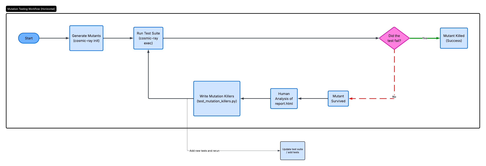
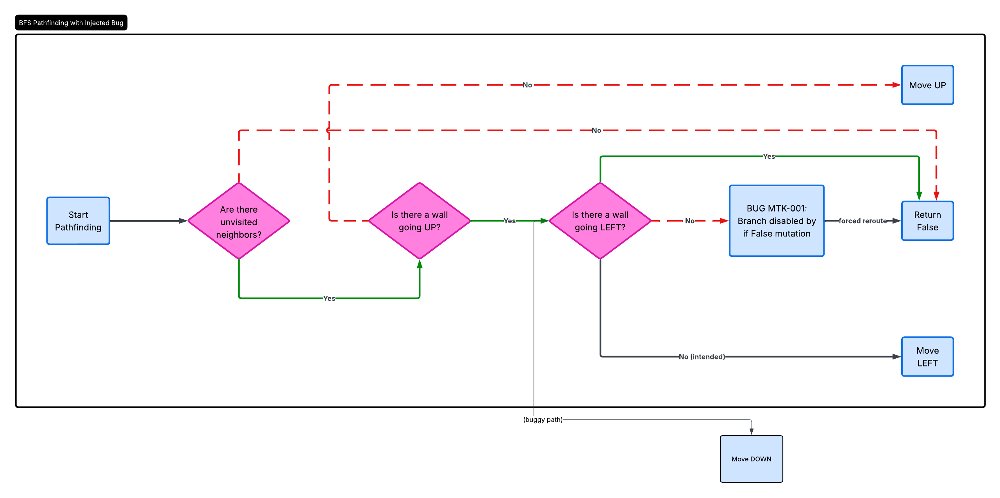
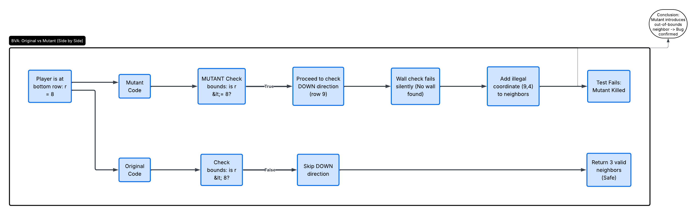

# Documentație: Analiza Mutațională și "Mutation Killers" 

## 1. Motivarea Alegerii Tehnologiilor (Tooling)

**De ce am ales `pytest` în loc de `unittest`?**
*   **Simplitate și Claritate:** `unittest` este un framework mai vechi care te obligă să scrii foarte mult "cod de umplutură" (clase și structuri rigide) doar pentru a face o verificare banală. În contrast, `pytest` merge pe ideea de simplitate: scrii testele ca pe niște funcții normale și naturale, făcând proiectul mult mai rapid de citit și de întreținut.
*   **Pregătirea automată a testelor:** Pentru un joc cum este Quoridor, avem nevoie de o tablă curată de joc la fiecare test. `pytest` simplifică enorm acest flux printr-un sistem prin care pregătește "scena" automat în fundal, fără să fim nevoiți să duplicăm codul de resetare.
*   **Standardul industriei:** Astăzi, Pytest este standardul *de facto* în companiile de IT moderne. Mai mult, oferă o experiență mult mai prietenoasă când un test eșuează: îți arată exact unde și de ce valorile nu s-au potrivit, oferind feedback imediat, spre deosebire de rapoartele adesea mai greu de descifrat din vechiul `unittest`.

**De ce am ales `Cosmic Ray` în loc de `mutmut` sau `MutPy` pentru testarea mutațională?**
*   **Acuratețea Mutațiilor (AST vs Regex):** `mutmut` folosește o abordare bazată pe manipularea de text (regex), ceea ce poate genera ocazional mutanți cu erori de sintaxă. În schimb, `Cosmic Ray` citește codul ca un "Abstract Syntax Tree" (înțelege efectiv logica de Python), garantând că defectele introduse sunt valabile din punct de vedere arhitectural.
*   **Managementul Sesiunilor (SQLite):** `Cosmic Ray` separă clar faza de generare a mutanților de execuția lor, stocând totul într-o bază de date `quoridor.sqlite`. Asta înseamnă că dacă procesul durează prea mult sau pică, el poate fi reluat de unde a rămas, oferind o trasabilitate excelentă (spre deosebire de `mutmut` care e mai expus la coruperea fișierelor cache).
*   **Raportare superioară pentru documentație:** Pentru cerințele proiectului, aveam nevoie de rapoarte clare. `Cosmic Ray` oferă utilitarul `cr-html` care generează rapoarte HTML independente, vizuale și detaliate, perfecte pentru a fi incluse ca dovezi în README și în prezentare.

---

## 2. Generarea Mutanților și Analiza Raportului

Pentru generarea mutanților a fost utilizat framework-ul **Cosmic Ray**. Automatizarea acestui proces este realizată prin scriptul `run_mut_test.py`.

### Scriptul `run_mut_test.py`
Acest script funcționează ca un orchestrator care execută secvențial comenzile specifice Cosmic Ray:
*   **Inițializare (`cosmic-ray init`):** Se parsează fișierul de configurare `quoridor.toml` și se identifică toate punctele din codul sursă unde se pot aplica operatori de mutație, rezultatele fiind salvate într-o bază de date SQLite (`quoridor.sqlite`).
*   **Execuție (`cosmic-ray exec`):** Fiecare mutant generat este injectat temporar în cod, urmat de rularea suitei de teste `pytest`.
*   **Evaluare și Raportare (`cr-rate` & `cr-html`):** La final, este calculat *Mutation Score-ul* (procentajul de mutanți omorâți de teste) și se generează un raport detaliat `report.html`.

Analiza raportului `report.html` ne-a permis să identificăm acei "surviving mutants" – mutanți care, deși modificau logica de funcționare a aplicației, nu făceau niciun test să pice (codul era acoperit de teste, dar testele nu erau suficient de aspre).

## 3. Teste Suplimentare pentru Mutanții Neechivalenți (`test_mutation_killers.py`)

Din raportul Cosmic Ray au fost selectați 2 mutanți neechivalenți (modificări care alterează comportamentul real al programului și ar fi trebuit detectate). Pentru aceștia, s-au implementat teste specifice ("strong mutation killers") în fișierul `test_mutation_killers.py`, folosind modelul **RSP (Reachability, State Infection, Propagation)**.

### Mutantul 1 (MTK-001): Eroare în Pathfinding (Algoritmul BFS)
*   **Linia afectată:** `Quoridor_Class.py:433`
*   **Mutația:** Ramura condițională a fost transformată din evaluarea logică validă într-un hardcoded `if False:`.
*   **Efect:** În algoritmul de Breadth-First Search (BFS) folosit pentru a verifica dacă jucătorul poate ajunge la linia de final, explorarea direcției STÂNGA (LEFT) este complet dezactivată.
*   **Cauza supraviețuirii:** Testele existente ofereau mereu trasee alternative; BFS-ul găsea drumul spre final ocolind pur și simplu prin dreapta sau prin sus. Nu exista un test în care STÂNGA să fie *singura* opțiune de ieșire.
*   **Testul Killer (`test_kills_mtk_001_has_path_left_branch_removed`):** Testul implementează un scenariu în care jucătorul este închis într-o "cușcă" formată din 3 pereți (Sus, Dreapta, Jos). Singura ieșire validă către linia de final este prin Stânga. Codul original găsește traseul, în timp ce codul mutant returnează `False` (rămâne blocat).

### Mutantul 2 (MTK-002): Relaxarea Limitelor Tablei de Joc
*   **Linia afectată:** `Quoridor_Class.py:467`
*   **Mutația:** Operatorul de comparație a fost schimbat din `<` în `<=`. (`r < BOARD_SIZE - 1` a devenit `r <= BOARD_SIZE - 1`).
*   **Efect:** Când verificarea se face pe ultima linie a tablei (linia 8), mutantul permite generarea unui "vecin" în partea de jos, la coordonata ilegală (linia 9), adică în afara tablei.
*   **Cauza supraviețuirii:** Niciun test unitar nu aserta în mod explicit granițele listei de vecini la extremitatea inferioară a tablei.
*   **Testul Killer (`test_kills_mtk_002_neighbors_down_bound_check_relaxed`):** Testul apelează metoda care generează vecinii direct pe o celulă de pe ultima linie. Apoi se face o verificare aspră a mulțimii returnate (Set Equality). Originalul returnează exact 3 vecini, pe când mutantul returnează 4 vecini, incluzând coordonata invalidă (9, 4), provocând eșuarea imediată a testului.

## 4. Sistem Manual de Testare Mutațională (`test_mutant_quoridor.py`)

Pe lângă automatizarea cu Cosmic Ray, am dezvoltat un instrument de validare personalizat pentru a ilustra manipularea mutațiilor direct pe AST / fișier sursă.
*   **Funcționalitate:** Scriptul definește manual 4 defecte (înlocuire de operator relațional, înlocuire de constantă, anulare a operației XOR de schimbare a jucătorului). Face un backup al fișierului sursă, injectează fiecare mutație folosind funcții de substituție a string-urilor, rulează procesul extern `pytest` și interpretează codul de ieșire.
*   **Scop:** Oferă un control absolut pentru demonstrațiile din timpul prezentării și validează nivelul de bază al suitei de teste unitare (verificând dacă detectează erorile majore introduse).

