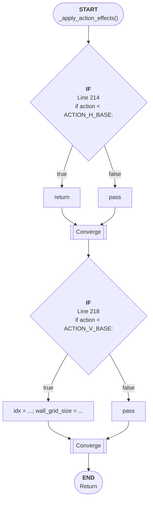

# Control Flow: _apply_action_effects()

**Method:** `_apply_action_effects()`
**Lines:** 213-231
**Parameters:** action
**Control Flow Elements:** 2
**Cyclomatic Complexity:** 3

## Legend

| Element | Description |
|---------|-------------|
| Round boxes | Entry/Exit points |
| Diamond | Decision point (if statement) |
| Rectangle | Loop or branch block |
| Double bracket | Convergence/merging point |
| Dotted line | Loop back edge |

## Control Flow Summary

- **If statements:** 2
  - Line 214: if action < ACTION_H_BASE:
  - Line 218: if action < ACTION_V_BASE: