# Control Flow: _blocked_with()

**Method:** `_blocked_with()`
**Lines:** 479-499
**Parameters:** r1, c1, r2, c2, h_walls, v_walls
**Control Flow Elements:** 14
**Cyclomatic Complexity:** 15

```mermaid
flowchart TD

  N0(["<b>START</b><br/>_blocked_with()"])
  N1{"<b>IF</b><br/>Line 481<br/>if r1 == r2:"}
  N0 --> N1
  N2["nested if ..."]
  N1 -->|true| N2
  N3["pass"]
  N1 -->|false| N3
  N4[["Converge"]]
  N2 --> N4
  N3 --> N4
  N5{"<b>IF</b><br/>Line 482<br/>if c2 == c1 + 1:"}
  N4 --> N5
  N6["..."]
  N5 -->|true| N6
  N7["nested if ..."]
  N5 -->|false| N7
  N8[["Converge"]]
  N6 --> N8
  N7 --> N8
  N9{"<b>FOR</b><br/>Line 483<br/>iter: for rr in (r1 - 1, r1):"}
  N8 --> N9
  N10["Iteration"]
  N9 --> N10
  N10 -."next iteration".-> N9
  N11[["Loop Complete"]]
  N9 -->|done| N11
  N12{"<b>IF</b><br/>Line 484<br/>if 0 <= rr < wall_grid_size and 0 <= c1 ..."}
  N11 --> N12
  N13["return True"]
  N12 -->|true| N13
  N14["pass"]
  N12 -->|false| N14
  N15[["Converge"]]
  N13 --> N15
  N14 --> N15
  N16{"<b>IF</b><br/>Line 486<br/>elif c2 == c1 - 1:"}
  N15 --> N16
  N17["..."]
  N16 -->|true| N17
  N18["pass"]
  N16 -->|false| N18
  N19[["Converge"]]
  N17 --> N19
  N18 --> N19
  N20{"<b>FOR</b><br/>Line 487<br/>iter: for rr in (r1 - 1, r1):"}
  N19 --> N20
  N21["Iteration"]
  N20 --> N21
  N21 -."next iteration".-> N20
  N22[["Loop Complete"]]
  N20 -->|done| N22
  N23{"<b>IF</b><br/>Line 488<br/>if 0 <= rr < wall_grid_size and 0 <= c2 ..."}
  N22 --> N23
  N24["return True"]
  N23 -->|true| N24
  N25["pass"]
  N23 -->|false| N25
  N26[["Converge"]]
  N24 --> N26
  N25 --> N26
  N27{"<b>IF</b><br/>Line 490<br/>if c1 == c2:"}
  N26 --> N27
  N28["nested if ..."]
  N27 -->|true| N28
  N29["pass"]
  N27 -->|false| N29
  N30[["Converge"]]
  N28 --> N30
  N29 --> N30
  N31{"<b>IF</b><br/>Line 491<br/>if r2 == r1 + 1:"}
  N30 --> N31
  N32["..."]
  N31 -->|true| N32
  N33["nested if ..."]
  N31 -->|false| N33
  N34[["Converge"]]
  N32 --> N34
  N33 --> N34
  N35{"<b>FOR</b><br/>Line 492<br/>iter: for cc in (c1 - 1, c1):"}
  N34 --> N35
  N36["Iteration"]
  N35 --> N36
  N36 -."next iteration".-> N35
  N37[["Loop Complete"]]
  N35 -->|done| N37
  N38{"<b>IF</b><br/>Line 493<br/>if 0 <= r1 < wall_grid_size and 0 <= cc ..."}
  N37 --> N38
  N39["return True"]
  N38 -->|true| N39
  N40["pass"]
  N38 -->|false| N40
  N41[["Converge"]]
  N39 --> N41
  N40 --> N41
  N42{"<b>IF</b><br/>Line 495<br/>elif r2 == r1 - 1:"}
  N41 --> N42
  N43["..."]
  N42 -->|true| N43
  N44["pass"]
  N42 -->|false| N44
  N45[["Converge"]]
  N43 --> N45
  N44 --> N45
  N46{"<b>FOR</b><br/>Line 496<br/>iter: for cc in (c1 - 1, c1):"}
  N45 --> N46
  N47["Iteration"]
  N46 --> N47
  N47 -."next iteration".-> N46
  N48[["Loop Complete"]]
  N46 -->|done| N48
  N49{"<b>IF</b><br/>Line 497<br/>if 0 <= r2 < wall_grid_size and 0 <= cc ..."}
  N48 --> N49
  N50["return True"]
  N49 -->|true| N50
  N51["pass"]
  N49 -->|false| N51
  N52[["Converge"]]
  N50 --> N52
  N51 --> N52
  N53(["<b>END</b><br/>Return"])
  N52 --> N53

```

## Legend

| Element | Description |
|---------|-------------|
| Round boxes | Entry/Exit points |
| Diamond | Decision point (if statement) |
| Rectangle | Loop or branch block |
| Double bracket | Convergence/merging point |
| Dotted line | Loop back edge |

## Control Flow Summary

- **If statements:** 10
  - Line 481: if r1 == r2:
  - Line 482: if c2 == c1 + 1:
  - Line 484: if 0 <= rr < wall_grid_size and 0 <= c1 < wall_grid_size ...
  - Line 486: elif c2 == c1 - 1:
  - Line 488: if 0 <= rr < wall_grid_size and 0 <= c2 < wall_grid_size ...
  - Line 490: if c1 == c2:
  - Line 491: if r2 == r1 + 1:
  - Line 493: if 0 <= r1 < wall_grid_size and 0 <= cc < wall_grid_size ...
  - Line 495: elif r2 == r1 - 1:
  - Line 497: if 0 <= r2 < wall_grid_size and 0 <= cc < wall_grid_size ...
- **For loops:** 4
  - Line 483: for rr in (r1 - 1, r1):
  - Line 487: for rr in (r1 - 1, r1):
  - Line 492: for cc in (c1 - 1, c1):
  - Line 496: for cc in (c1 - 1, c1):