# Control Flow: _blocked_with_temp()

**Method:** `_blocked_with_temp()`
**Lines:** 337-390
**Parameters:** r1, c1, r2, c2, h_walls, v_walls, temp_h, temp_v
**Control Flow Elements:** 18
**Cyclomatic Complexity:** 19

```mermaid
flowchart TD

  N0(["<b>START</b><br/>_blocked_with_temp()"])
  N1{"<b>IF</b><br/>Line 345<br/>if r1 == r2:"}
  N0 --> N1
  N2["nested if ...; rr = ..."]
  N1 -->|true| N2
  N3["pass"]
  N1 -->|false| N3
  N4[["Converge"]]
  N2 --> N4
  N3 --> N4
  N5{"<b>IF</b><br/>Line 346<br/>if c2 == c1 + 1:"}
  N4 --> N5
  N6["wc = c1"]
  N5 -->|true| N6
  N7["nested if ..."]
  N5 -->|false| N7
  N8[["Converge"]]
  N6 --> N8
  N7 --> N8
  N9{"<b>IF</b><br/>Line 348<br/>elif c2 == c1 - 1:"}
  N8 --> N9
  N10["wc = c2"]
  N9 -->|true| N10
  N11["return False"]
  N9 -->|false| N11
  N12[["Converge"]]
  N10 --> N12
  N11 --> N12
  N13{"<b>IF</b><br/>Line 354<br/>if 0 <= rr < wall_grid_size:"}
  N12 --> N13
  N14["nested if ...; nested if ..."]
  N13 -->|true| N14
  N15["pass"]
  N13 -->|false| N15
  N16[["Converge"]]
  N14 --> N16
  N15 --> N16
  N17{"<b>IF</b><br/>Line 355<br/>if v_walls[rr, wc]:"}
  N16 --> N17
  N18["return True"]
  N17 -->|true| N18
  N19["pass"]
  N17 -->|false| N19
  N20[["Converge"]]
  N18 --> N20
  N19 --> N20
  N21{"<b>IF</b><br/>Line 357<br/>if temp_v is not None and temp_v == (rr,..."}
  N20 --> N21
  N22["return True"]
  N21 -->|true| N22
  N23["pass"]
  N21 -->|false| N23
  N24[["Converge"]]
  N22 --> N24
  N23 --> N24
  N25{"<b>IF</b><br/>Line 360<br/>if 0 <= rr < wall_grid_size:"}
  N24 --> N25
  N26["nested if ...; nested if ..."]
  N25 -->|true| N26
  N27["pass"]
  N25 -->|false| N27
  N28[["Converge"]]
  N26 --> N28
  N27 --> N28
  N29{"<b>IF</b><br/>Line 361<br/>if v_walls[rr, wc]:"}
  N28 --> N29
  N30["return True"]
  N29 -->|true| N30
  N31["pass"]
  N29 -->|false| N31
  N32[["Converge"]]
  N30 --> N32
  N31 --> N32
  N33{"<b>IF</b><br/>Line 363<br/>if temp_v is not None and temp_v == (rr,..."}
  N32 --> N33
  N34["return True"]
  N33 -->|true| N34
  N35["pass"]
  N33 -->|false| N35
  N36[["Converge"]]
  N34 --> N36
  N35 --> N36
  N37{"<b>IF</b><br/>Line 368<br/>if c1 == c2:"}
  N36 --> N37
  N38["nested if ...; cc = ..."]
  N37 -->|true| N38
  N39["pass"]
  N37 -->|false| N39
  N40[["Converge"]]
  N38 --> N40
  N39 --> N40
  N41{"<b>IF</b><br/>Line 369<br/>if r2 == r1 + 1:"}
  N40 --> N41
  N42["wr = r1"]
  N41 -->|true| N42
  N43["nested if ..."]
  N41 -->|false| N43
  N44[["Converge"]]
  N42 --> N44
  N43 --> N44
  N45{"<b>IF</b><br/>Line 371<br/>elif r2 == r1 - 1:"}
  N44 --> N45
  N46["wr = r2"]
  N45 -->|true| N46
  N47["return False"]
  N45 -->|false| N47
  N48[["Converge"]]
  N46 --> N48
  N47 --> N48
  N49{"<b>IF</b><br/>Line 377<br/>if 0 <= cc < wall_grid_size:"}
  N48 --> N49
  N50["nested if ...; nested if ..."]
  N49 -->|true| N50
  N51["pass"]
  N49 -->|false| N51
  N52[["Converge"]]
  N50 --> N52
  N51 --> N52
  N53{"<b>IF</b><br/>Line 378<br/>if h_walls[wr, cc]:"}
  N52 --> N53
  N54["return True"]
  N53 -->|true| N54
  N55["pass"]
  N53 -->|false| N55
  N56[["Converge"]]
  N54 --> N56
  N55 --> N56
  N57{"<b>IF</b><br/>Line 380<br/>if temp_h is not None and temp_h == (wr,..."}
  N56 --> N57
  N58["return True"]
  N57 -->|true| N58
  N59["pass"]
  N57 -->|false| N59
  N60[["Converge"]]
  N58 --> N60
  N59 --> N60
  N61{"<b>IF</b><br/>Line 383<br/>if 0 <= cc < wall_grid_size:"}
  N60 --> N61
  N62["nested if ...; nested if ..."]
  N61 -->|true| N62
  N63["pass"]
  N61 -->|false| N63
  N64[["Converge"]]
  N62 --> N64
  N63 --> N64
  N65{"<b>IF</b><br/>Line 384<br/>if h_walls[wr, cc]:"}
  N64 --> N65
  N66["return True"]
  N65 -->|true| N66
  N67["pass"]
  N65 -->|false| N67
  N68[["Converge"]]
  N66 --> N68
  N67 --> N68
  N69{"<b>IF</b><br/>Line 386<br/>if temp_h is not None and temp_h == (wr,..."}
  N68 --> N69
  N70["return True"]
  N69 -->|true| N70
  N71["pass"]
  N69 -->|false| N71
  N72[["Converge"]]
  N70 --> N72
  N71 --> N72
  N73(["<b>END</b><br/>Return"])
  N72 --> N73

```

## Legend

| Element | Description |
|---------|-------------|
| Round boxes | Entry/Exit points |
| Diamond | Decision point (if statement) |
| Rectangle | Loop or branch block |
| Double bracket | Convergence/merging point |
| Dotted line | Loop back edge |

## Control Flow Summary

- **If statements:** 18
  - Line 345: if r1 == r2:
  - Line 346: if c2 == c1 + 1:
  - Line 348: elif c2 == c1 - 1:
  - Line 354: if 0 <= rr < wall_grid_size:
  - Line 355: if v_walls[rr, wc]:
  - Line 357: if temp_v is not None and temp_v == (rr, wc):
  - Line 360: if 0 <= rr < wall_grid_size:
  - Line 361: if v_walls[rr, wc]:
  - Line 363: if temp_v is not None and temp_v == (rr, wc):
  - Line 368: if c1 == c2:
  - Line 369: if r2 == r1 + 1:
  - Line 371: elif r2 == r1 - 1:
  - Line 377: if 0 <= cc < wall_grid_size:
  - Line 378: if h_walls[wr, cc]:
  - Line 380: if temp_h is not None and temp_h == (wr, cc):
  - Line 383: if 0 <= cc < wall_grid_size:
  - Line 384: if h_walls[wr, cc]:
  - Line 386: if temp_h is not None and temp_h == (wr, cc):