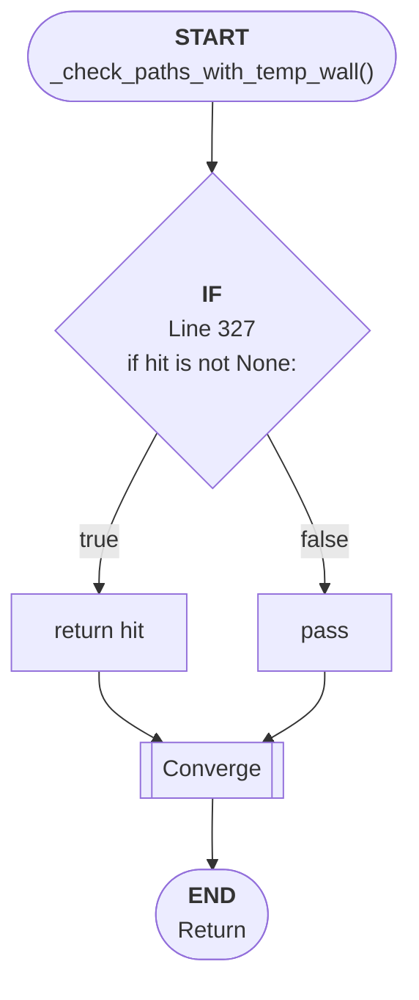

# Control Flow: _check_paths_with_temp_wall()

**Method:** `_check_paths_with_temp_wall()`
**Lines:** 319-334
**Parameters:** h, v
**Control Flow Elements:** 1
**Cyclomatic Complexity:** 2

## Legend

| Element | Description |
|---------|-------------|
| Round boxes | Entry/Exit points |
| Diamond | Decision point (if statement) |
| Rectangle | Loop or branch block |
| Double bracket | Convergence/merging point |
| Dotted line | Loop back edge |

## Control Flow Summary

- **If statements:** 1
  - Line 327: if hit is not None: