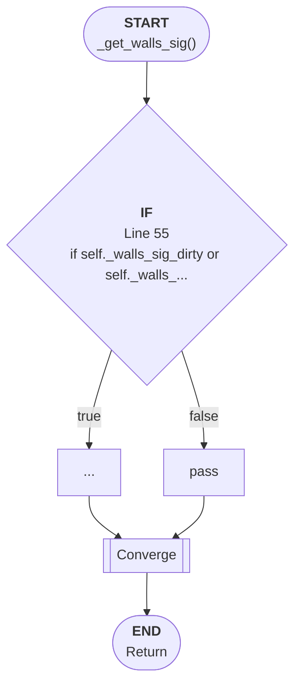

# Control Flow: _get_walls_sig()

**Method:** `_get_walls_sig()`
**Lines:** 50-58
**Parameters:** self (implicit)
**Control Flow Elements:** 1
**Cyclomatic Complexity:** 2

## Legend

| Element | Description |
|---------|-------------|
| Round boxes | Entry/Exit points |
| Diamond | Decision point (if statement) |
| Rectangle | Loop or branch block |
| Double bracket | Convergence/merging point |
| Dotted line | Loop back edge |

## Control Flow Summary

- **If statements:** 1
  - Line 55: if self._walls_sig_dirty or self._walls_sig is None: