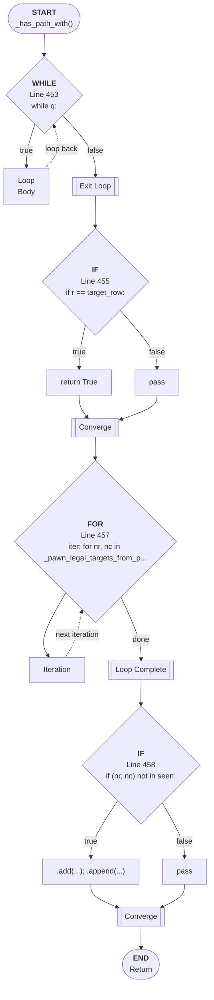

# Control Flow: _has_path_with()

**Method:** `_has_path_with()`
**Lines:** 445-461
**Parameters:** start, target_row, h_walls, v_walls
**Control Flow Elements:** 4
**Cyclomatic Complexity:** 5

## Legend

| Element | Description |
|---------|-------------|
| Round boxes | Entry/Exit points |
| Diamond | Decision point (if statement) |
| Rectangle | Loop or branch block |
| Double bracket | Convergence/merging point |
| Dotted line | Loop back edge |

## Control Flow Summary

- **If statements:** 2
  - Line 455: if r == target_row:
  - Line 458: if (nr, nc) not in seen:
- **While loops:** 1
  - Line 453: while q:
- **For loops:** 1
  - Line 457: for nr, nc in _pawn_legal_targets_from_pos(self, player_i...