# Control Flow: _has_path_with_temp()

**Method:** `_has_path_with_temp()`
**Lines:** 392-443
**Parameters:** start, target_row, temp_h, temp_v
**Control Flow Elements:** 12
**Cyclomatic Complexity:** 13

```mermaid
flowchart TD

  N0(["<b>START</b><br/>_has_path_with_temp()"])
  N1{"<b>IF</b><br/>Line 397<br/>if sr == target_row:"}
  N0 --> N1
  N2["return True"]
  N1 -->|true| N2
  N3["pass"]
  N1 -->|false| N3
  N4[["Converge"]]
  N2 --> N4
  N3 --> N4
  N5{"<b>WHILE</b><br/>Line 409<br/>while q:"}
  N4 --> N5
  N6["Loop<br/>Body"]
  N5 -->|true| N6
  N6 -."loop back".-> N5
  N7[["Exit Loop"]]
  N5 -->|false| N7
  N8{"<b>IF</b><br/>Line 415<br/>if r > 0:"}
  N7 --> N8
  N9["ni = ...; nested if ..."]
  N8 -->|true| N9
  N10["pass"]
  N8 -->|false| N10
  N11[["Converge"]]
  N9 --> N11
  N10 --> N11
  N12{"<b>IF</b><br/>Line 417<br/>if not visited[ni] and not self._blocked..."}
  N11 --> N12
  N13["nested if ...; .append(...)"]
  N12 -->|true| N13
  N14["pass"]
  N12 -->|false| N14
  N15[["Converge"]]
  N13 --> N15
  N14 --> N15
  N16{"<b>IF</b><br/>Line 418<br/>if r - 1 == target_row:"}
  N15 --> N16
  N17["return True"]
  N16 -->|true| N17
  N18["pass"]
  N16 -->|false| N18
  N19[["Converge"]]
  N17 --> N19
  N18 --> N19
  N20{"<b>IF</b><br/>Line 423<br/>if r < BOARD_SIZE - 1:"}
  N19 --> N20
  N21["ni = ...; nested if ..."]
  N20 -->|true| N21
  N22["pass"]
  N20 -->|false| N22
  N23[["Converge"]]
  N21 --> N23
  N22 --> N23
  N24{"<b>IF</b><br/>Line 425<br/>if not visited[ni] and not self._blocked..."}
  N23 --> N24
  N25["nested if ...; .append(...)"]
  N24 -->|true| N25
  N26["pass"]
  N24 -->|false| N26
  N27[["Converge"]]
  N25 --> N27
  N26 --> N27
  N28{"<b>IF</b><br/>Line 426<br/>if r + 1 == target_row:"}
  N27 --> N28
  N29["return True"]
  N28 -->|true| N29
  N30["pass"]
  N28 -->|false| N30
  N31[["Converge"]]
  N29 --> N31
  N30 --> N31
  N32{"<b>IF</b><br/>Line 431<br/>if c > 0:"}
  N31 --> N32
  N33["ni = ...; nested if ..."]
  N32 -->|true| N33
  N34["pass"]
  N32 -->|false| N34
  N35[["Converge"]]
  N33 --> N35
  N34 --> N35
  N36{"<b>IF</b><br/>Line 433<br/>if not visited[ni] and not self._blocked..."}
  N35 --> N36
  N37[".append(...)"]
  N36 -->|true| N37
  N38["pass"]
  N36 -->|false| N38
  N39[["Converge"]]
  N37 --> N39
  N38 --> N39
  N40{"<b>IF</b><br/>Line 437<br/>if c < BOARD_SIZE - 1:"}
  N39 --> N40
  N41["ni = ...; nested if ..."]
  N40 -->|true| N41
  N42["pass"]
  N40 -->|false| N42
  N43[["Converge"]]
  N41 --> N43
  N42 --> N43
  N44{"<b>IF</b><br/>Line 439<br/>if not visited[ni] and not self._blocked..."}
  N43 --> N44
  N45[".append(...)"]
  N44 -->|true| N45
  N46["pass"]
  N44 -->|false| N46
  N47[["Converge"]]
  N45 --> N47
  N46 --> N47
  N48(["<b>END</b><br/>Return"])
  N47 --> N48

```

## Legend

| Element | Description |
|---------|-------------|
| Round boxes | Entry/Exit points |
| Diamond | Decision point (if statement) |
| Rectangle | Loop or branch block |
| Double bracket | Convergence/merging point |
| Dotted line | Loop back edge |

## Control Flow Summary

- **If statements:** 11
  - Line 397: if sr == target_row:
  - Line 415: if r > 0:
  - Line 417: if not visited[ni] and not self._blocked_with_temp(r, c, ...
  - Line 418: if r - 1 == target_row:
  - Line 423: if r < BOARD_SIZE - 1:
  - Line 425: if not visited[ni] and not self._blocked_with_temp(r, c, ...
  - Line 426: if r + 1 == target_row:
  - Line 431: if c > 0:
  - Line 433: if not visited[ni] and not self._blocked_with_temp(r, c, ...
  - Line 437: if c < BOARD_SIZE - 1:
  - Line 439: if not visited[ni] and not self._blocked_with_temp(r, c, ...
- **While loops:** 1
  - Line 409: while q: