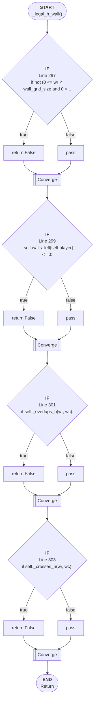

# Control Flow: _legal_h_wall()

**Method:** `_legal_h_wall()`
**Lines:** 295-305
**Parameters:** wr, wc
**Control Flow Elements:** 4
**Cyclomatic Complexity:** 5

## Legend

| Element | Description |
|---------|-------------|
| Round boxes | Entry/Exit points |
| Diamond | Decision point (if statement) |
| Rectangle | Loop or branch block |
| Double bracket | Convergence/merging point |
| Dotted line | Loop back edge |

## Control Flow Summary

- **If statements:** 4
  - Line 297: if not (0 <= wr < wall_grid_size and 0 <= wc < wall_grid_...
  - Line 299: if self.walls_left[self.player] <= 0:
  - Line 301: if self._overlaps_h(wr, wc):
  - Line 303: if self._crosses_h(wr, wc):