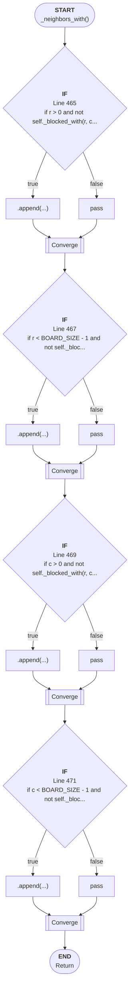

# Control Flow: _neighbors_with()

**Method:** `_neighbors_with()`
**Lines:** 463-473
**Parameters:** r, c, h_walls, v_walls
**Control Flow Elements:** 4
**Cyclomatic Complexity:** 5

## Legend

| Element | Description |
|---------|-------------|
| Round boxes | Entry/Exit points |
| Diamond | Decision point (if statement) |
| Rectangle | Loop or branch block |
| Double bracket | Convergence/merging point |
| Dotted line | Loop back edge |

## Control Flow Summary

- **If statements:** 4
  - Line 465: if r > 0 and not self._blocked_with(r, c, r - 1, c, h_wal...
  - Line 467: if r < BOARD_SIZE - 1 and not self._blocked_with(r, c, r ...
  - Line 469: if c > 0 and not self._blocked_with(r, c, r, c - 1, h_wal...
  - Line 471: if c < BOARD_SIZE - 1 and not self._blocked_with(r, c, r,...