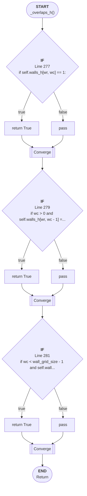

# Control Flow: _overlaps_h()

**Method:** `_overlaps_h()`
**Lines:** 275-283
**Parameters:** wr, wc
**Control Flow Elements:** 3
**Cyclomatic Complexity:** 4

## Legend

| Element | Description |
|---------|-------------|
| Round boxes | Entry/Exit points |
| Diamond | Decision point (if statement) |
| Rectangle | Loop or branch block |
| Double bracket | Convergence/merging point |
| Dotted line | Loop back edge |

## Control Flow Summary

- **If statements:** 3
  - Line 277: if self.walls_h[wr, wc] == 1:
  - Line 279: if wc > 0 and self.walls_h[wr, wc - 1] == 1:
  - Line 281: if wc < wall_grid_size - 1 and self.walls_h[wr, wc + 1] =...