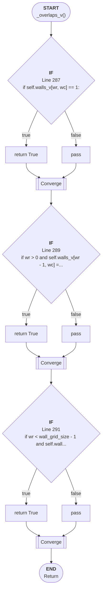

# Control Flow: _overlaps_v()

**Method:** `_overlaps_v()`
**Lines:** 285-293
**Parameters:** wr, wc
**Control Flow Elements:** 3
**Cyclomatic Complexity:** 4

## Legend

| Element | Description |
|---------|-------------|
| Round boxes | Entry/Exit points |
| Diamond | Decision point (if statement) |
| Rectangle | Loop or branch block |
| Double bracket | Convergence/merging point |
| Dotted line | Loop back edge |

## Control Flow Summary

- **If statements:** 3
  - Line 287: if self.walls_v[wr, wc] == 1:
  - Line 289: if wr > 0 and self.walls_v[wr - 1, wc] == 1:
  - Line 291: if wr < wall_grid_size - 1 and self.walls_v[wr + 1, wc] =...