# Control Flow: _pawn_legal_targets()

**Method:** `_pawn_legal_targets()`
**Lines:** 233-265
**Parameters:** cr, cc, opp
**Control Flow Elements:** 11
**Cyclomatic Complexity:** 12

```mermaid
flowchart TD

  N0(["<b>START</b><br/>_pawn_legal_targets()"])
  N1{"<b>FOR</b><br/>Line 240<br/>iter: for dr, dc in [(-1, 0), (1, 0), (0, -1),..."}
  N0 --> N1
  N2["Iteration"]
  N1 --> N2
  N2 -."next iteration".-> N1
  N3[["Loop Complete"]]
  N1 -->|done| N3
  N4{"<b>IF</b><br/>Line 242<br/>if not (0 <= nr < BOARD_SIZE and 0 <= nc..."}
  N3 --> N4
  N5["..."]
  N4 -->|true| N5
  N6["pass"]
  N4 -->|false| N6
  N7[["Converge"]]
  N5 --> N7
  N6 --> N7
  N8{"<b>IF</b><br/>Line 244<br/>if not can_cross(cr, cc, nr, nc):"}
  N7 --> N8
  N9["..."]
  N8 -->|true| N9
  N10["pass"]
  N8 -->|false| N10
  N11[["Converge"]]
  N9 --> N11
  N10 --> N11
  N12{"<b>IF</b><br/>Line 246<br/>if (nr, nc) == (orr, occ):"}
  N11 --> N12
  N13["nested if ..."]
  N12 -->|true| N13
  N14[".add(...)"]
  N12 -->|false| N14
  N15[["Converge"]]
  N13 --> N15
  N14 --> N15
  N16{"<b>IF</b><br/>Line 248<br/>if 0 <= jr < BOARD_SIZE and 0 <= jc < BO..."}
  N15 --> N16
  N17["nested if ..."]
  N16 -->|true| N17
  N18["nested if ..."]
  N16 -->|false| N18
  N19[["Converge"]]
  N17 --> N19
  N18 --> N19
  N20{"<b>IF</b><br/>Line 249<br/>if (jr, jc) != (cr, cc):"}
  N19 --> N20
  N21[".add(...)"]
  N20 -->|true| N21
  N22["pass"]
  N20 -->|false| N22
  N23[["Converge"]]
  N21 --> N23
  N22 --> N23
  N24{"<b>IF</b><br/>Line 252<br/>if dr != 0:"}
  N23 --> N24
  N25["..."]
  N24 -->|true| N25
  N26["..."]
  N24 -->|false| N26
  N27[["Converge"]]
  N25 --> N27
  N26 --> N27
  N28{"<b>FOR</b><br/>Line 253<br/>iter: for dc2 in (-1, 1):"}
  N27 --> N28
  N29["Iteration"]
  N28 --> N29
  N29 -."next iteration".-> N28
  N30[["Loop Complete"]]
  N28 -->|done| N30
  N31{"<b>IF</b><br/>Line 255<br/>if 0 <= ac < BOARD_SIZE and can_cross(nr..."}
  N30 --> N31
  N32[".add(...)"]
  N31 -->|true| N32
  N33["pass"]
  N31 -->|false| N33
  N34[["Converge"]]
  N32 --> N34
  N33 --> N34
  N35{"<b>FOR</b><br/>Line 258<br/>iter: for dr2 in (-1, 1):"}
  N34 --> N35
  N36["Iteration"]
  N35 --> N36
  N36 -."next iteration".-> N35
  N37[["Loop Complete"]]
  N35 -->|done| N37
  N38{"<b>IF</b><br/>Line 260<br/>if 0 <= ar < BOARD_SIZE and can_cross(nr..."}
  N37 --> N38
  N39[".add(...)"]
  N38 -->|true| N39
  N40["pass"]
  N38 -->|false| N40
  N41[["Converge"]]
  N39 --> N41
  N40 --> N41
  N42(["<b>END</b><br/>Return"])
  N41 --> N42

```

## Legend

| Element | Description |
|---------|-------------|
| Round boxes | Entry/Exit points |
| Diamond | Decision point (if statement) |
| Rectangle | Loop or branch block |
| Double bracket | Convergence/merging point |
| Dotted line | Loop back edge |

## Control Flow Summary

- **If statements:** 8
  - Line 242: if not (0 <= nr < BOARD_SIZE and 0 <= nc < BOARD_SIZE):
  - Line 244: if not can_cross(cr, cc, nr, nc):
  - Line 246: if (nr, nc) == (orr, occ):
  - Line 248: if 0 <= jr < BOARD_SIZE and 0 <= jc < BOARD_SIZE and can_...
  - Line 249: if (jr, jc) != (cr, cc):
  - Line 252: if dr != 0:
  - Line 255: if 0 <= ac < BOARD_SIZE and can_cross(nr, nc, ar, ac):
  - Line 260: if 0 <= ar < BOARD_SIZE and can_cross(nr, nc, ar, ac):
- **For loops:** 3
  - Line 240: for dr, dc in [(-1, 0), (1, 0), (0, -1), (0, 1)]:
  - Line 253: for dc2 in (-1, 1):
  - Line 258: for dr2 in (-1, 1):