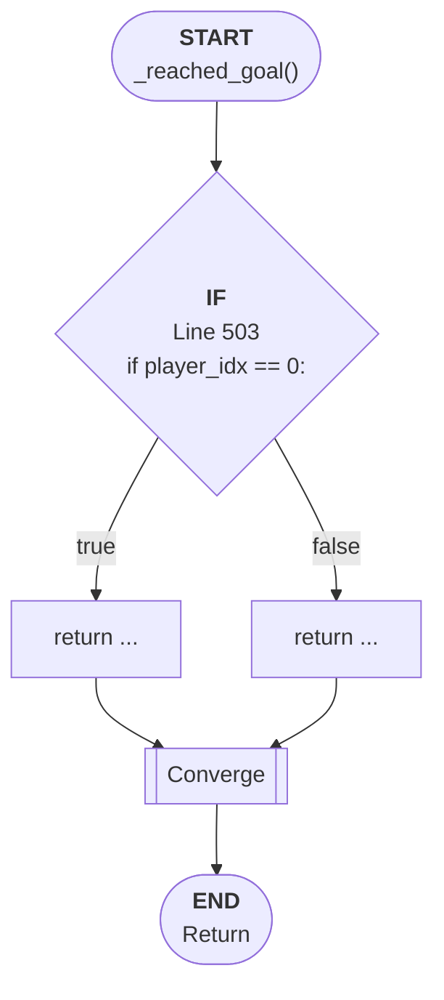

# Control Flow: _reached_goal()

**Method:** `_reached_goal()`
**Lines:** 501-506
**Parameters:** player_idx
**Control Flow Elements:** 1
**Cyclomatic Complexity:** 2

## Legend

| Element | Description |
|---------|-------------|
| Round boxes | Entry/Exit points |
| Diamond | Decision point (if statement) |
| Rectangle | Loop or branch block |
| Double bracket | Convergence/merging point |
| Dotted line | Loop back edge |

## Control Flow Summary

- **If statements:** 1
  - Line 503: if player_idx == 0: