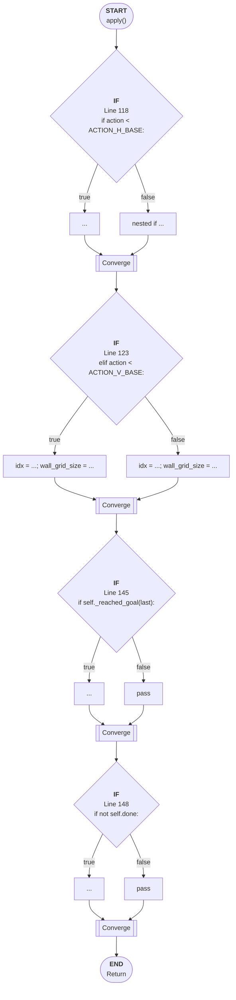

# Control Flow: apply()

**Method:** `apply()`
**Lines:** 114-150
**Parameters:** action
**Control Flow Elements:** 4
**Cyclomatic Complexity:** 5

## Legend

| Element | Description |
|---------|-------------|
| Round boxes | Entry/Exit points |
| Diamond | Decision point (if statement) |
| Rectangle | Loop or branch block |
| Double bracket | Convergence/merging point |
| Dotted line | Loop back edge |

## Control Flow Summary

- **If statements:** 4
  - Line 118: if action < ACTION_H_BASE:
  - Line 123: elif action < ACTION_V_BASE:
  - Line 145: if self._reached_goal(last):
  - Line 148: if not self.done: