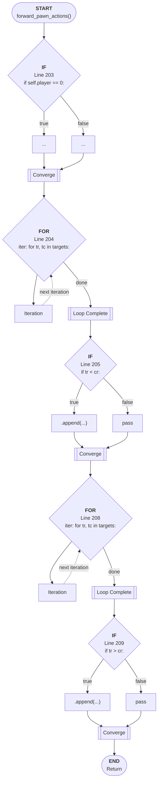

# Control Flow: forward_pawn_actions()

**Method:** `forward_pawn_actions()`
**Lines:** 198-211
**Parameters:** self (implicit)
**Control Flow Elements:** 5
**Cyclomatic Complexity:** 6

## Legend

| Element | Description |
|---------|-------------|
| Round boxes | Entry/Exit points |
| Diamond | Decision point (if statement) |
| Rectangle | Loop or branch block |
| Double bracket | Convergence/merging point |
| Dotted line | Loop back edge |

## Control Flow Summary

- **If statements:** 3
  - Line 203: if self.player == 0:
  - Line 205: if tr < cr:
  - Line 209: if tr > cr:
- **For loops:** 2
  - Line 204: for tr, tc in targets:
  - Line 208: for tr, tc in targets: