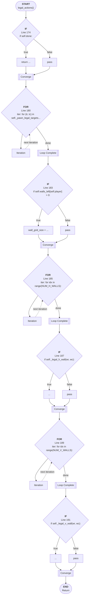

# Control Flow: legal_actions()

**Method:** `legal_actions()`
**Lines:** 173-193
**Parameters:** self (implicit)
**Control Flow Elements:** 7
**Cyclomatic Complexity:** 8

## Legend

| Element | Description |
|---------|-------------|
| Round boxes | Entry/Exit points |
| Diamond | Decision point (if statement) |
| Rectangle | Loop or branch block |
| Double bracket | Convergence/merging point |
| Dotted line | Loop back edge |

## Control Flow Summary

- **If statements:** 4
  - Line 174: if self.done:
  - Line 183: if self.walls_left[self.player] > 0:
  - Line 187: if self._legal_h_wall(wr, wc):
  - Line 191: if self._legal_v_wall(wr, wc):
- **For loops:** 3
  - Line 180: for (tr, tc) in self._pawn_legal_targets(cr, cc, opp):
  - Line 185: for idx in range(NUM_H_WALLS):
  - Line 189: for idx in range(NUM_V_WALLS):