# Control Flow: step()

**Method:** `step()`
**Lines:** 84-112
**Parameters:** action
**Control Flow Elements:** 8
**Cyclomatic Complexity:** 9

```mermaid
flowchart TD

  N0(["<b>START</b><br/>step()"])
  N1{"<b>IF</b><br/>Line 85<br/>if self.done:"}
  N0 --> N1
  N2["..."]
  N1 -->|true| N2
  N3["pass"]
  N1 -->|false| N3
  N4[["Converge"]]
  N2 --> N4
  N3 --> N4
  N5{"<b>IF</b><br/>Line 87<br/>if not self.is_legal(action):"}
  N4 --> N5
  N6["return ..."]
  N5 -->|true| N6
  N7["pass"]
  N5 -->|false| N7
  N8[["Converge"]]
  N6 --> N8
  N7 --> N8
  N9{"<b>IF</b><br/>Line 94<br/>if self._reached_goal(last):"}
  N8 --> N9
  N10["..."]
  N9 -->|true| N10
  N11["pass"]
  N9 -->|false| N11
  N12[["Converge"]]
  N10 --> N12
  N11 --> N12
  N13{"<b>IF</b><br/>Line 97<br/>if not self.done:"}
  N12 --> N13
  N14["..."]
  N13 -->|true| N14
  N15["pass"]
  N13 -->|false| N15
  N16[["Converge"]]
  N14 --> N16
  N15 --> N16
  N17{"<b>IF</b><br/>Line 100<br/>if not self.done:"}
  N16 --> N17
  N18["pos_key = ...; nested if ..."]
  N17 -->|true| N18
  N19["pass"]
  N17 -->|false| N19
  N20[["Converge"]]
  N18 --> N20
  N19 --> N20
  N21{"<b>IF</b><br/>Line 103<br/>if self._position_history[pos_key] >= 3:"}
  N20 --> N21
  N22["..."]
  N21 -->|true| N22
  N23["pass"]
  N21 -->|false| N23
  N24[["Converge"]]
  N22 --> N24
  N23 --> N24
  N25{"<b>IF</b><br/>Line 109<br/>if self.done:"}
  N24 --> N25
  N26["nested if ..."]
  N25 -->|true| N26
  N27["pass"]
  N25 -->|false| N27
  N28[["Converge"]]
  N26 --> N28
  N27 --> N28
  N29{"<b>IF</b><br/>Line 110<br/>if self.winner is not None:"}
  N28 --> N29
  N30["reward = ..."]
  N29 -->|true| N30
  N31["pass"]
  N29 -->|false| N31
  N32[["Converge"]]
  N30 --> N32
  N31 --> N32
  N33(["<b>END</b><br/>Return"])
  N32 --> N33

```

## Legend

| Element | Description |
|---------|-------------|
| Round boxes | Entry/Exit points |
| Diamond | Decision point (if statement) |
| Rectangle | Loop or branch block |
| Double bracket | Convergence/merging point |
| Dotted line | Loop back edge |

## Control Flow Summary

- **If statements:** 8
  - Line 85: if self.done:
  - Line 87: if not self.is_legal(action):
  - Line 94: if self._reached_goal(last):
  - Line 97: if not self.done:
  - Line 100: if not self.done:
  - Line 103: if self._position_history[pos_key] >= 3:
  - Line 109: if self.done:
  - Line 110: if self.winner is not None: